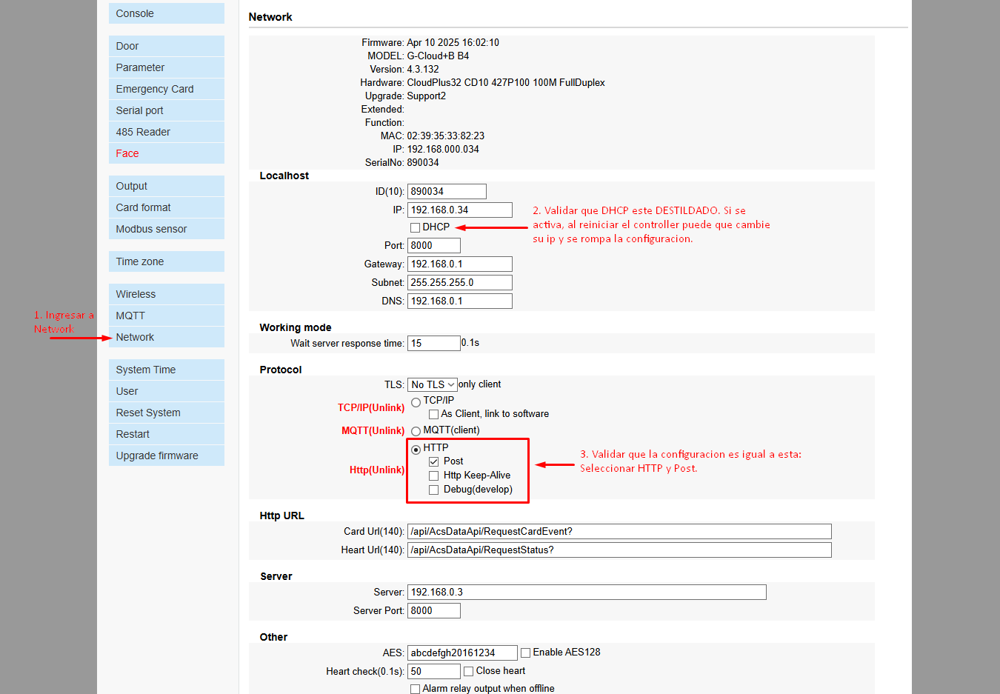
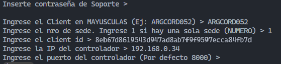
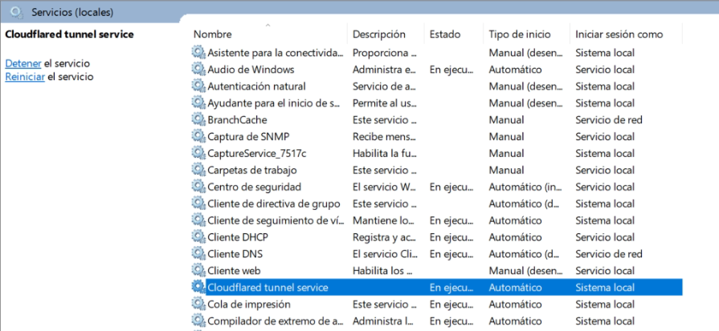
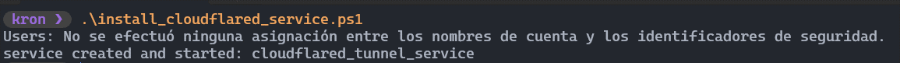
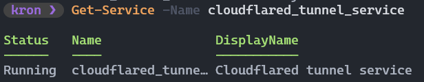

# GFitness

Este documento describe el procedimiento de instalación del control de acceso con placa **CloudAccess**, una placa IP que se conecta directamente al molinete y se configura desde su propio panel web, además del túnel de Cloudflare que la comunica con SocioPLUS. Está dirigido al equipo de soporte técnico encargado de realizar la instalación en la sede del cliente.


No se debe pactar un turno de instalación sin que el cliente haya confirmado por escrito el cumplimiento de los requisitos de la sección siguiente, e informado el nombre completo de la persona a cargo del puesto de trabajo durante la instalación.


## Requisitos previos a la instalación

El puesto de trabajo donde se realizará la instalación (o reinstalación) debe cumplir con los siguientes requisitos mínimos de hardware y software:

| Componente | Requisito |
|---|---|
| Procesador | Intel i3 o AMD Ryzen 3 (mínimo) — Intel i5 o AMD Ryzen 5 (recomendado) |
| Memoria RAM | 16 GB (mínimo) |
| Disco rígido | 500 GB (mínimo) |
| Sistema operativo | Windows 10/11 de 64 bits |
| Explorador web | Firefox (recomendado) |
| Software adicional | [AnyDesk](https://anydesk.com/es) instalado |
| Conectividad | Conexión a internet óptima y estable |
| Hardware | Placa ya conectada al molinete |

Además, se debe verificar en la sede:

* Todos los periféricos de la PC (teclado, mouse, lector, molinete, etc.) deben estar correctamente conectados y en óptimo funcionamiento.
* Debe permanecer una persona en la PC durante toda la instalación, para asistir al técnico y validar las pruebas necesarias.
* Se recomienda conexión a internet por cable Ethernet.
* Si existía una instalación previa en ese puesto, se debe tener en cuenta su estado al momento de coordinar la nueva instalación.


Antes de instalar, se debe hacer pasar previamente a la persona a cargo por los **Términos y condiciones** del servicio.


## Procedimiento de instalación



### Configurar el controlador

Ingresá al panel de configuración del controlador colocando su IP en un navegador, con las credenciales `admin:888888`.

Entrá a `Network` y verificá los siguientes puntos:

1. Que `DHCP` esté **desactivado**. Si está activo, al reiniciar el controlador puede cambiar su IP y romper la configuración.
2. En `Protocol`, que esté seleccionado `HTTP` y tildado `Post`.



Bajá hasta el final de la página y guardá con **Save**. Se va a pedir reiniciar el controlador para que los cambios surtan efecto: hacelo.



### Descargar el instalador

Descargá el archivo `.rar` de instalación y descomprimilo en la carpeta `Documentos`.



### Instalar cloudflared

Dentro de `assets`, ingresá al acceso directo **Descargar cloudflared** para descargar la última versión.


Ejecutalo como administrador para instalarlo.





### Ejecutar el setup

Abrí la carpeta `SocioPLUS` y ejecutá `setup.exe`. Ingresá la contraseña de soporte `SP2022`.

Al ingresar la contraseña se abrirá una pestaña en el navegador predeterminado. Copiá rápidamente el enlace de esa pestaña, cerrala e ingresá el enlace desde tu computadora (si no lo llegás a copiar a tiempo, podés volver a abrir el setup). Si no estás logueado, ingresá con la cuenta de Google de Soporte.

Una vez que se abra, hacé clic en `socioplusaccess.com.ar` y luego en **Autorizar**.


Por último, seguí completando los datos que pide la terminal del setup: cliente en mayúsculas, número de sede, ID de cliente, IP del controlador y su puerto (por defecto `8000`).





### Instalar el servicio del túnel

Abrí una PowerShell como administrador en la carpeta `assets` y ejecutá:

```powershell
.\install_cloudflared_service.ps1
```

Esto levanta un servicio que inicia el túnel automáticamente al prender la PC.



Validá que, desde Cloudflare, el túnel esté creado y la conexión en estado `Healthy`.

Además, podés probarlo desde la misma PowerShell con:

```powershell
Get-Service -Name "cloudflared_tunnel_service"
```



También podés chequear en la lista de servicios de Windows que esté presente el `Cloudflared tunnel service`.



### Desactivar la suspensión del equipo

Buscá en Windows **Editar plan de energía** e ingresá.


Modificá la opción `Poner el equipo en estado de suspensión` a **Nunca** y guardá los cambios.





### Cargar los datos de los nodos en la gestión

Completá la información de los nodos, previamente consultada al cliente, en `gestion.socioplus.com.ar/soporte` buscando por ID de cliente. Primero ingresá a la sede correspondiente y luego a `Nodos`.



Asegurate de que los datos queden guardados correctamente en el cliente seleccionado antes de dar por cerrada la instalación.




## Solución de problemas frecuentes

<details>

<summary>El túnel no se levanta al prender la PC</summary>

Abrí una PowerShell como administrador y escribí:

```powershell
Get-Service -Name cloudflared_tunnel_service
```

Esto te va a indicar si el servicio de Cloudflare está corriendo.



* Si el estado es `Running`, podés reiniciarlo con `Restart-Service -Name cloudflared_tunnel_service`.
* Si está `Stopped`, podés levantarlo con `Start-Service -Name cloudflared_tunnel_service`.
* Si al iniciarlo no levanta el túnel, volvé a ejecutar el paso **"Instalar el servicio del túnel"**.
* Si aun así no funciona, borrá el contenido de la carpeta `.cloudflared` en la raíz del usuario, el contenido de `C:\ProgramData\Cloudflare`, el túnel y los DNS (ver el apartado siguiente), y volvé a ejecutar los pasos **"Instalar el servicio del túnel"** y **"Desactivar la suspensión del equipo"**.

</details>

<details>

<summary>El túnel ya existe</summary>

1. Borrá los registros DNS desde el [panel de DNS de Cloudflare](https://dash.cloudflare.com/982b2c155832920d5daed442e2c2fc6c/socioplusaccess.com.ar/dns/records). Identificá el registro que corresponde al cliente y la sede que estás instalando (por ejemplo, `nodo1-argcord052-1`), hacé clic en **Editar** y luego en **Eliminar**. Si también existe un registro `server-<cliente>-<sede>`, eliminalo también.



No modifiques ni elimines el registro `socioplusaccess.com.ar`: es necesario para el control de acceso con placa IP.


2. Borrá el túnel. Ingresá al [panel de túneles de Cloudflare](https://one.dash.cloudflare.com/982b2c155832920d5daed442e2c2fc6c/access/tunnels?search=), identificá el túnel a eliminar por cliente y sede, hacé clic en los tres puntos del margen derecho y seleccioná **Delete**.


3. Por último, ingresá a la carpeta del usuario de la PC (`C:\Users\<USUARIO>`) y luego a `.cloudflared`, y eliminá todos los archivos **excepto** `cert.pem`.


Si borrás `cert.pem` vas a tener que autenticarte de nuevo. Podés borrarlo y volver a loguear si tenés problemas persistentes con el túnel.


</details>
