# Control de acceso — Reconocimiento facial

Este documento describe el procedimiento completo de instalación del sistema de control de acceso por reconocimiento facial de SocioPLUS. Está dirigido al equipo de soporte técnico encargado de coordinar e implementar la instalación en la sede del cliente. Cubre los requisitos previos que debe cumplir el puesto de trabajo, la lógica de validación de accesos, los dispositivos compatibles, el paso a paso de la instalación del software y la resolución de los problemas más frecuentes.


No se debe pactar un turno de instalación sin que el cliente haya confirmado por escrito el cumplimiento de los requisitos de la sección siguiente, e informado el nombre completo de la persona a cargo del puesto de trabajo durante la instalación.


## Requisitos previos a la instalación

El puesto de trabajo donde se realizará la instalación (o reinstalación) debe cumplir con los siguientes requisitos mínimos de hardware y software:

| Componente         | Requisito                                                              |
| ------------------ | ---------------------------------------------------------------------- |
| Procesador         | Intel i3 o AMD Ryzen 3 (mínimo) — Intel i5 o AMD Ryzen 5 (recomendado) |
| Memoria RAM        | 16 GB (mínimo)                                                         |
| Disco rígido       | 500 GB (mínimo)                                                        |
| Sistema operativo  | Windows 10/11 de 64 bits                                               |
| Explorador web     | Firefox (recomendado)                                                  |
| Software adicional | [AnyDesk](https://anydesk.com/es) instalado                            |
| Conectividad       | Conexión a internet óptima y estable                                   |
| Hardware           | Lector de reconocimiento facial                                        |

Además, se debe verificar en la sede:

* Todos los periféricos de la PC (teclado, mouse, lector, molinete, etc.) deben estar correctamente conectados y en óptimo funcionamiento.
* Debe permanecer una persona en la PC durante toda la instalación, para asistir al técnico y validar las pruebas necesarias.
* Se recomienda conexión a internet por cable Ethernet antes que por Wi-Fi.
* Si existía una instalación previa en ese puesto, se debe tener en cuenta su estado al momento de coordinar la nueva instalación.


Antes de instalar, se debe hacer pasar previamente a la persona a cargo por los **Términos y condiciones** del servicio.


## Cómo valida el acceso el sistema

El dispositivo de reconocimiento facial permite el ingreso siempre que el socio tenga un contrato activo y una foto de perfil cargada (desde el sistema web o la aplicación móvil).

Sin embargo, el dispositivo solo controla el reconocimiento físico. Es el sistema web de SocioPLUS el que valida si ese acceso es correcto, según el contrato que tenga el socio y si dispone de pases y/o reservas.


Un socio puede pasar el control físico de acceso aunque no cumpla las condiciones para que el sistema lo registre como correcto. Por ejemplo: puede ingresar a pesar de no tener más pases disponibles en su perfil.


Para que el sistema valide correctamente el acceso y descuente el pase o la reserva correspondiente, el contrato del socio debe estar cargado de una de estas dos formas:

* **Con pases:** el concepto debe estar configurado con `PASE LIBRE` en `NO`, y el socio debe disponer de pases disponibles.
* **Con reservas:** el socio va a poder ingresar independientemente de si tiene o no la reserva, pero es el sistema el que valida si esa reserva corresponde con el día y la hora en que está ingresando, para contabilizar el presente.

### Vincular los planes a los nodos

Para que los socios ingresen correctamente y el sistema web valide su acceso, sus contratos deben estar vinculados a los nodos correspondientes.



### Ingresar a la configuración del sistema

Entrá a `Menú` › `Setup` › `Configuración del sistema`.



### Editar el concepto

Localizá el concepto que vas a vincular y entrá a `Editar concepto` › `Deseo solo vincular planes a los nodos`.



### Seleccionar los nodos y guardar

Seleccioná el o los nodos por los cuales podrá ingresar el socio, y hacé clic en **Guardar** para aplicar los cambios.

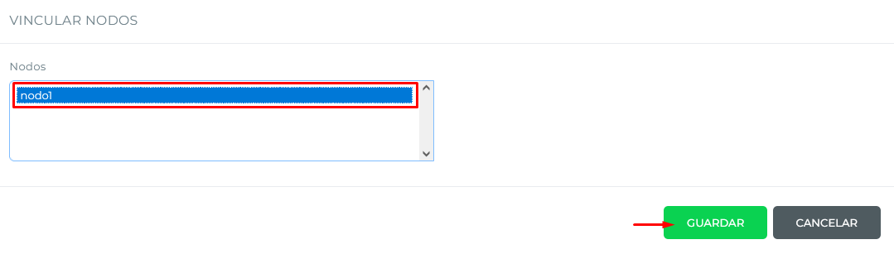




Tras este cambio, los socios que contraten el plan a partir de ese momento van a transmitirse correctamente a los nodos seleccionados. Los socios que ya tenían el contrato cargado previamente **no** se actualizan solos: hay que hacerlo manualmente.


Para actualizar un contrato ya cargado:



### Ingresar al perfil del socio

Entrá al perfil del socio y luego a `Contrataciones`.



### Editar el contrato vigente

En el contrato vigente, entrá a `Opciones` › `Editar contrato Vto.`



### Actualizar

Hacé clic en **Actualizar**. De esta manera, el socio se transmite al nodo.



## Llaveros y tarjetas

Para utilizar la funcionalidad de llaveros, se debe conectar un lector de tarjetas externo mediante protocolo Wiegand o RS-485, y utilizar tarjetas M1. Se recomienda el **ZKTeco KR101E/M** o el **Hikvision DS-K1101M**.


Si se utiliza el protocolo Wiegand, la dirección del mismo debe configurarse como `INPUT`.


Si el cliente quiere actualizar a un dispositivo con más capacidad de caras, se puede migrar a los socios ya cargados al nuevo dispositivo. Esta migración tiene un costo extra.

## Dispositivos compatibles

| Marca     | Modelo                                                                                                                                 | Capacidad                      | Lector de tarjetas | Conectividad    | Velocidad                  | Distancia de reconocimiento |
| --------- | -------------------------------------------------------------------------------------------------------------------------------------- | ------------------------------ | ------------------ | --------------- | -------------------------- | --------------------------- |
| HikVision | [DS-K1T673DWX](https://www.hikvision.com/en/products/Access-Control-Products/Face-Recognition-Terminals/Pro-Series/ds-k1t673dwx/)      | 10.000 caras / 50.000 tarjetas | Sí                 | WiFi - Ethernet | Menos de 0,2 s por usuario | 0,3 a 3 metros              |
| HikVision | [DS-K1T642MW](https://www.hikvision.com/es-la/products/Access-Control-Products/Face-Recognition-Terminals/Pro-Series/ds-k1t642mw/)     | 6.000 caras / 10.000 tarjetas  | —                  | WiFi - Ethernet | Menos de 0,2 s por usuario | 0,3 a 3 metros              |
| HikVision | [DS-K1T341AM](https://www.hikvision.com/es-la/products/Access-Control-Products/Face-Recognition-Terminals/Value-Series/ds-k1t341am/)   | 3.000 caras / 3.000 tarjetas   | —                  | WiFi - Ethernet | Menos de 0,2 s por usuario | 0,3 a 1,5 metros            |
| HikVision | [DS-K1T343MWX](https://www.hikvision.com/es-la/products/Access-Control-Products/Face-Recognition-Terminals/Value-Series/ds-k1t343mwx/) | 1.500 caras / 3.000 tarjetas   | —                  | WiFi - Ethernet | Menos de 0,2 s por usuario | 0,3 a 1,5 metros            |

## Procedimiento de instalación



### Descargar el instalador

Descargá el archivo `Control Acceso Reconocimiento Facial.rar` desde [este enlace de Google Drive](https://drive.google.com/drive/folders/1cOHhF9ikR396iqHwJMX-uX-vYfNRjAir?usp=drive_link) y descomprimilo en la carpeta `Documentos`.



### Instalar Npcap

Ingresá a la carpeta `SocioPLUS` › `assets` e instalá `npcap.exe`.

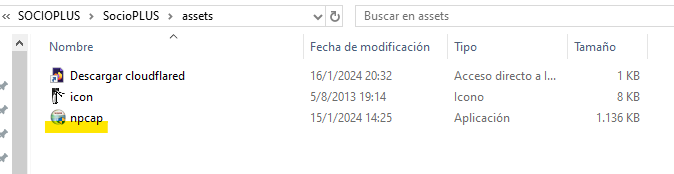

Cuando el instalador lo pida, marcá las siguientes opciones:

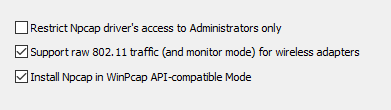



### Instalar cloudflared

Dentro de `assets`, ingresá al acceso directo **Descargar cloudflared** para descargar la última versión.

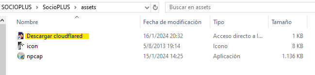

Ejecutalo como administrador para instalarlo.

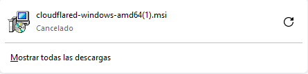



### Ejecutar el setup

Abrí la carpeta `SocioPLUS` y ejecutá `setup.exe`. Ingresá la contraseña de soporte `SP2022`.

Al ingresar la contraseña se abrirá una pestaña en el navegador predeterminado. Copiá rápidamente el enlace de esa pestaña, cerrala e ingresá el enlace desde tu computadora (si no lo llegás a copiar a tiempo, podés volver a abrir el setup). Si no estás logueado, ingresá con la cuenta de Google de Soporte.

Una vez que se abra, hacé clic en `socioplusaccess.com.ar` y luego en **Autorizar**.

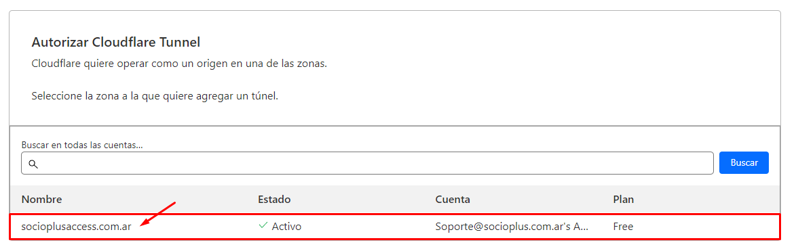

Por último, seguí completando los datos que pide la terminal del setup: cliente, sede, cantidad de nodos, MAC e IP de cada nodo, usuario y contraseña de la cuenta admin de cada nodo, y cantidad máxima de logs a guardar.

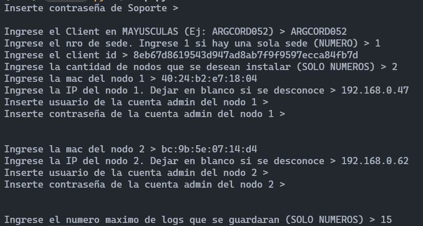


La contraseña de soporte y las credenciales del reloj de cada nodo no se muestran en la terminal a medida que se escriben, pero sí se están cargando.



La MAC se debe escribir completa en minúsculas, separada por dos puntos (`:`). Ejemplo: `bc:9b:5e:07:14:d4`.




### Habilitar la ejecución de scripts en PowerShell

Presioná la tecla Windows, buscá **Windows PowerShell**, hacé clic derecho y seleccioná **Ejecutar como administrador**.

Una vez abierta la consola, ejecutá el comando:

```powershell
Set-ExecutionPolicy -ExecutionPolicy Bypass
```

Cuando se pida confirmar el cambio, escribí la letra `O` y presioná **Enter**.

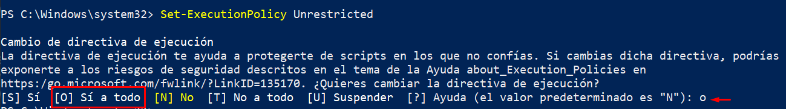



### Asociar el script de inicio con PowerShell

Ingresá a la carpeta `assets`, localizá el archivo `startup_script.ps1`, hacé clic derecho y entrá a `Propiedades` › `Cambiar…` › `Windows PowerShell`.

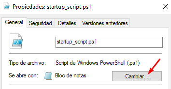

Si Windows PowerShell no aparece en la lista de aplicaciones, hacé clic en **Más aplicaciones** › **Buscar otra aplicación en el equipo**. Se va a abrir una ventana: **no la cierres todavía**.

Abrí una consola CMD y escribí:

```
where.exe powershell
```

Vas a obtener una ruta similar a esta:

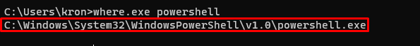

Copiá esa ruta hasta la última barra `\` (sin incluir `powershell.exe`) y pegala en la barra superior de la ventana que quedó abierta. Por último, hacé clic en `powershell.exe` y en **Abrir**.

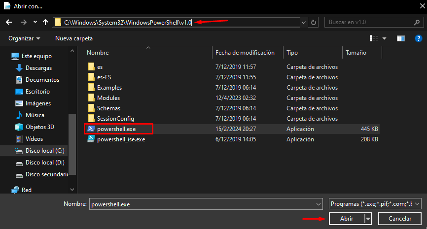

Para terminar, hacé clic en **Aplicar** en la ventana de propiedades.

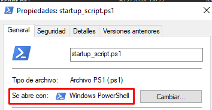



### Desactivar la suspensión del equipo

Buscá en Windows **Editar plan de energía** e ingresá.

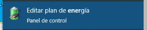

Modificá la opción `Poner el equipo en estado de suspensión` a **Nunca** y guardá los cambios.

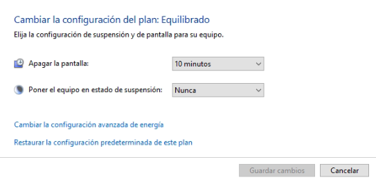



### Ejecutar el script de inicio

Hacé clic derecho sobre `startup_script.ps1` y seleccioná `Ejecutar con PowerShell`. Si todo está correcto, se va a abrir una ventana brevemente y luego se va a cerrar sola, pero el programa va a quedar corriendo en segundo plano. Podés verificarlo en los iconos ocultos de la barra de tareas.

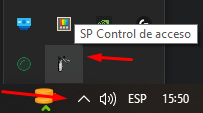


Solo hace falta abrir manualmente `startup_script.ps1` durante la instalación. El setup ya genera un acceso directo en la carpeta de inicio de Windows, así que el programa se va a abrir solo en segundo plano cada vez que se prenda la PC.




### Cargar los datos de los nodos en la gestión

Completá la información de los nodos, previamente consultada al cliente, en `gestion.socioplus.com.ar/soporte` buscando por ID de cliente. Primero ingresá a la sede correspondiente y luego a `Nodos`.


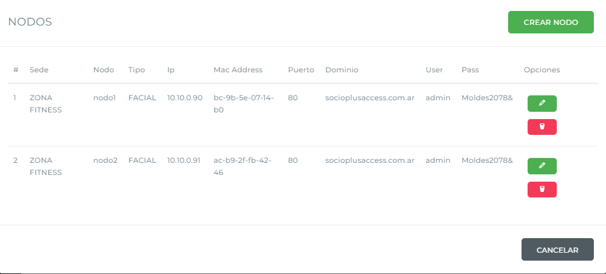


Asegurate de que los datos queden guardados correctamente en el cliente seleccionado antes de dar por cerrada la instalación.




## Modo debug

Se puede iniciar `SPReconFacial.exe` con el argumento `--debug` para activar el modo debug. Este modo muestra todos los dispositivos encontrados durante el escaneo de red, y es útil cuando el sistema no logra encontrar la IP del reloj.

## Solución remota de problemas

A partir de la versión 2.0 (y en los equipos que se actualizaron a esa versión), el servidor tiene una dirección pública con el formato `server-<cliente>-<sede>.socioplusaccess.com.ar`, desde la cual se puede:

* Consultar `config.json` y `config.yaml` (de cloudflared) en la ruta `/debug`.
* Descargar la carpeta de logs en la ruta `/logs`.


Ambas rutas piden usuario y contraseña. Las credenciales son: usuario `soporteSocioplus`, contraseña `SP2022`.


## El control de acceso no responde (sin conexión)

Cuando un control de acceso facial no responde, hacé estos tres chequeos antes de decidir cómo seguir:



### Verificar que el programa esté abierto

Localizá el ícono del molinete (`SP Control de acceso`) en los iconos ocultos de la barra de tareas.


Si no lo encontrás ahí, buscalo también en el Administrador de tareas (`Ctrl + Shift + Esc`).



### Verificar el estado del túnel

Entrá al [panel de túneles de Cloudflare](https://one.dash.cloudflare.com/982b2c155832920d5daed442e2c2fc6c/access/tunnels?search=) y fijate que el túnel esté en estado `HEALTHY`. Si no estás logueado, ingresá con las credenciales de la cuenta de soporte.



### Verificar la conexión de los nodos

Comprobá que la IP de cada nodo responda al hacer `ping`, y que se pueda acceder a ella desde el navegador de la PC del cliente mediante AnyDesk.


Es fundamental que **todos** los nodos tengan conexión. Si falta uno solo, el programa no va a arrancar.




Según el resultado de estos tres chequeos, el diagnóstico y la solución cambian:

<details>

<summary>Caso 1 — El programa NO está abierto y el túnel SÍ tiene conexión (Healthy)</summary>

Entrá al Administrador de tareas (`Ctrl + Shift + Esc`) y terminá todos los procesos `cloudflared.exe`. Repetí esto hasta que el túnel muestre estado `DOWN`.

</details>

<details>

<summary>Caso 2 — El programa SÍ está abierto y el túnel NO tiene conexión (Down)</summary>

Reiniciá la PC e intentá nuevamente. Si después de reiniciar el túnel sigue sin conexión, seguí los pasos del apartado **"El túnel ya existe"**, más abajo en la sección "Solución de problemas frecuentes" de esta misma guía, y volvé a correr el setup para reconfigurar el túnel.

</details>

<details>

<summary>Caso 3 — El programa SÍ está abierto y el túnel SÍ tiene conexión (Healthy), pero no podemos conectarnos a los nodos</summary>

Este caso se da cuando, al intentar entrar al dominio del nodo desde **nuestro** navegador (no el del cliente), no conseguimos acceso. El formato del dominio es:

```
https://nodo{nro_nodo}-{cliente}-{nro_sede}.socioplusaccess.com.ar
```

Por ejemplo: `https://nodo1-argneuq009-1.socioplusaccess.com.ar`.

Verificá que los nodos tengan conexión mediante `ping` y que sean accesibles desde el navegador del cliente vía AnyDesk. Pedile al cliente que desconecte los nodos, que espere 5 minutos y que los vuelva a conectar. Repetí los tres chequeos del comienzo de esta sección.

</details>

Después de aplicar la solución que corresponda, ejecutá nuevamente el programa con el archivo `startup_script.ps1` (clic derecho › `Ejecutar con PowerShell`, igual que en el paso "Ejecutar el script de inicio" del procedimiento de instalación). Esto asegura que se detecten los cambios en las IPs de los nodos, si los hubo, y que se actualice la configuración de cloudflared.


Para saber la IP asociada a la MAC de cada nodo, podés usar el comando `arp -a` en una consola.


## Solución de problemas frecuentes

<details>

<summary>El programa no se ejecuta al prender la PC, o se abre el Bloc de notas</summary>

1. Verificá que el archivo `SPReconFacial_executable` se encuentre en la carpeta de inicio de Windows. Se accede presionando `Win + R`, escribiendo `shell:startup` y presionando **Aceptar**.
2. Abrí el Administrador de tareas (clic derecho en la barra de tareas › `Administrador de tareas`) › `Más detalles` › pestaña `Inicio` o `Arranque`, y verificá que `startup script` esté habilitado.
3. Verificá que el script `startup_script.ps1`, dentro de `SocioPLUS/assets`, se abra con PowerShell (clic derecho › `Propiedades`).


</details>

<details>

<summary>El túnel sigue abierto a pesar de que SPReconFacial está cerrado</summary>

1. Abrí una consola CMD como administrador.
2. Ejecutá `tasklist | FINDSTR "cloudflared.exe"` y/o `tasklist | FINDSTR "SPReconFacial.exe"` para ver el número de proceso.
3. Ejecutá `kill` seguido del número de proceso.

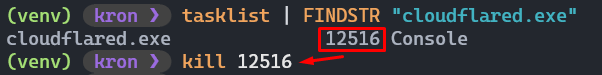

</details>

<details>

<summary>El túnel ya existe</summary>

1. Borrá los registros DNS desde el [panel de DNS de Cloudflare](https://dash.cloudflare.com/982b2c155832920d5daed442e2c2fc6c/socioplusaccess.com.ar/dns/records). Identificá el registro que corresponde al cliente y la sede que estás instalando (por ejemplo, `nodo1-argcord052-1`), hacé clic en **Editar** y luego en **Eliminar**. Si también existe un registro `server-<cliente>-<sede>`, eliminalo también.

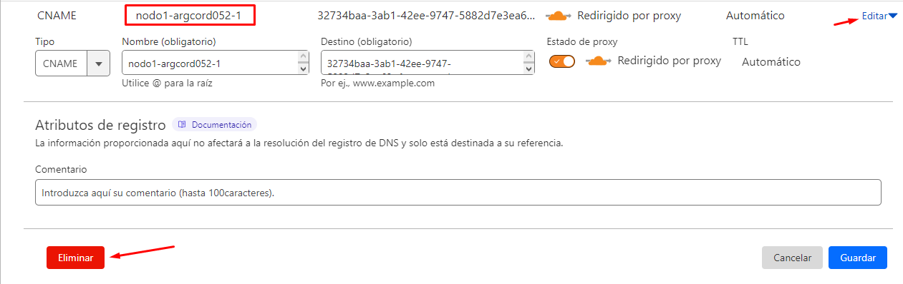


No modifiques ni elimines el registro `socioplusaccess.com.ar`: es necesario para el control de acceso con placa IP.


2. Borrá el túnel. Ingresá al [panel de túneles de Cloudflare](https://one.dash.cloudflare.com/982b2c155832920d5daed442e2c2fc6c/access/tunnels?search=), identificá el túnel a eliminar por cliente y sede, hacé clic en los tres puntos del margen derecho y seleccioná **Delete**.

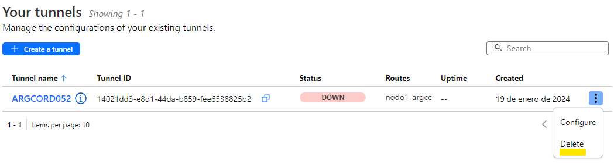

3. Por último, ingresá a la carpeta del usuario de la PC (`C:\Users\<USUARIO>`) y luego a `.cloudflared`, y eliminá todos los archivos **excepto** `cert.pem`.


Si borrás `cert.pem` vas a tener que autenticarte de nuevo. Podés borrarlo y volver a loguear si tenés problemas persistentes con el túnel.


</details>

<details>

<summary>Error: json.decoder.JSONDecodeError: Expecting value: line 1 column 1 (char 0)</summary>

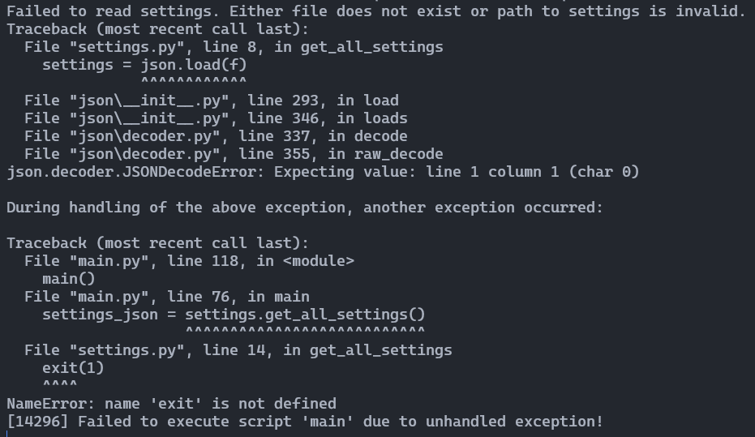

**Causa:** el archivo `settings.json` no contiene información, o el formato JSON es incorrecto.

**Solución:** completá los datos faltantes del archivo y/o corregí el formato JSON.

</details>

<details>

<summary>Verificar la configuración del dispositivo Hikvision</summary>

Se accede al panel del dispositivo mediante su IP desde la computadora del cliente, o desde la URL del nodo (por ejemplo, `nodo1-argcord052…`).

Verificá que el dispositivo **no** esté enviando las fotos al autenticar (`Person Management` › `Privacy Settings`):

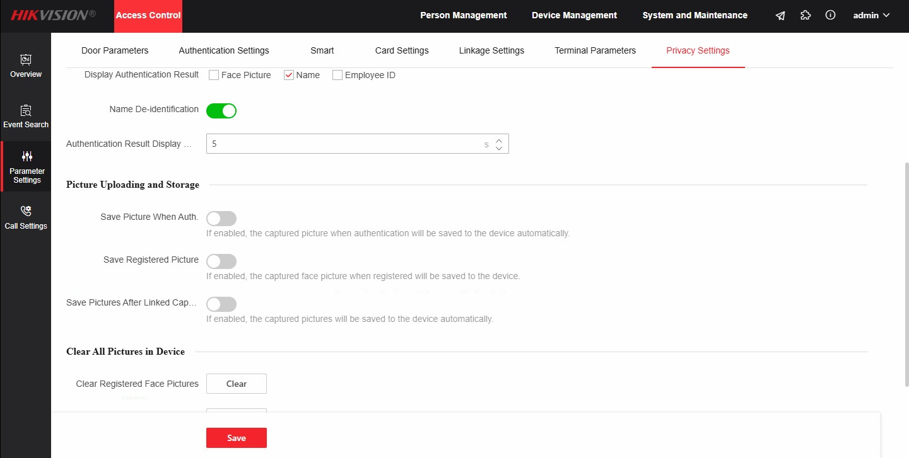

Verificá que el dispositivo tenga configurados los siguientes parámetros en `Network Service`: la IP de la PC y el puerto `8000`.

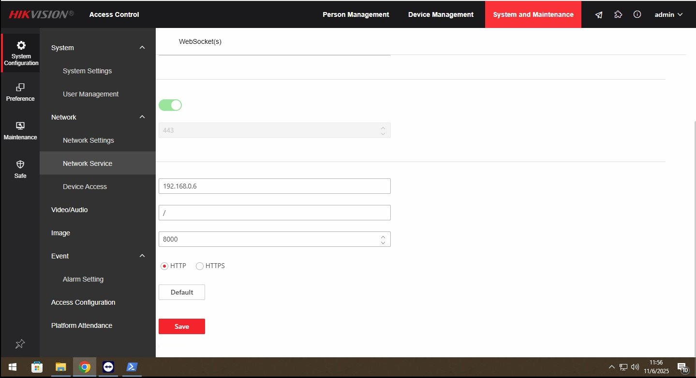

</details>
