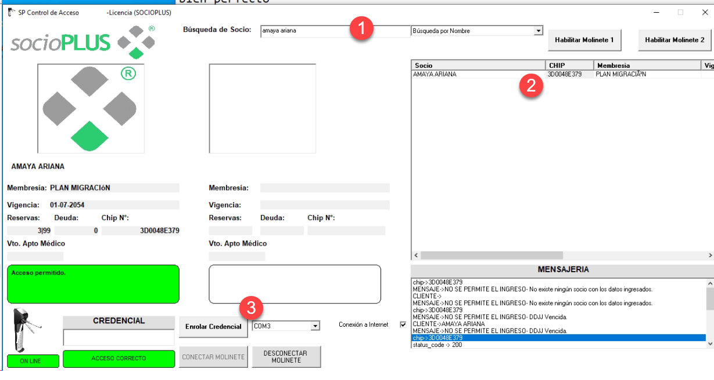
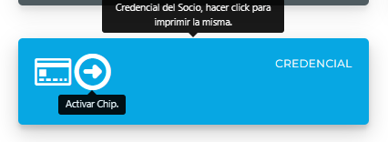
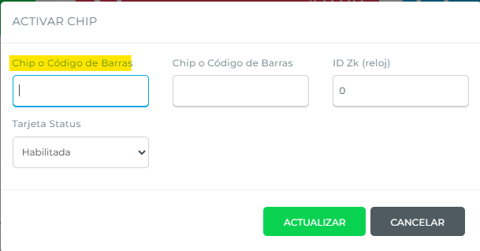

# Cómo enrolar una credencial

Hay dos formas de enrolar una credencial a un socio: desde el programa `SPacceso`, instalado en la PC del control de acceso, o directamente desde el perfil del socio en el sistema web de SocioPLUS.

## Enrolar desde SPacceso



### Abrir el programa

Abrí el programa `SPacceso`, instalado en la PC.



### Pasar el llavero por el lector

Pasá el llavero que querés enrolar por el lector.



### Buscar al socio

Buscá al socio al que le vas a enrolar el llavero, desde el programa correspondiente.



### Seleccionar al socio

Seleccioná al socio haciendo clic en su nombre o en el chip detectado. Su nombre debería aparecer del lado izquierdo de la pantalla.



### Enrolar la credencial

Hacé clic en **Enrolar Credencial**. El sistema te va a pedir una confirmación: hacé clic en **Sí**.




## Enrolar desde el perfil del socio



### Verificar el número de credencial

Fijate cuál es el número de credencial que tiene asignado el chip.



### Ingresar al perfil del socio

Desde el sistema web de SocioPLUS, entrá al perfil del socio al que le querés enrolar la credencial.



### Activar el chip

En el apartado `Credencial`, hacé clic en **Activar Chip**.




### Cargar el número de credencial

Se va a abrir una ventana emergente pidiendo el número de credencial. Ese número no debe tener ni más ni menos de **8 dígitos**.




### Actualizar

Hacé clic en **Actualizar** para guardar la credencial y dejarla enrolada en el perfil del socio.


