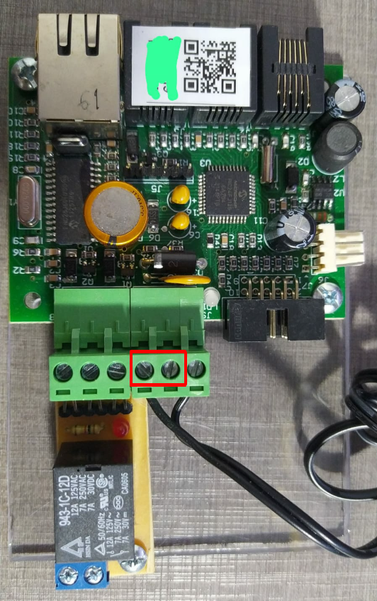
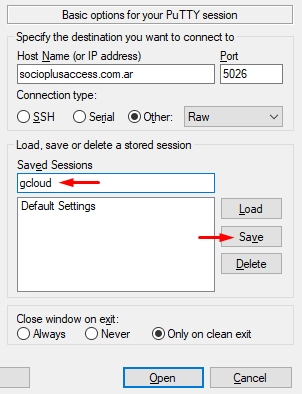
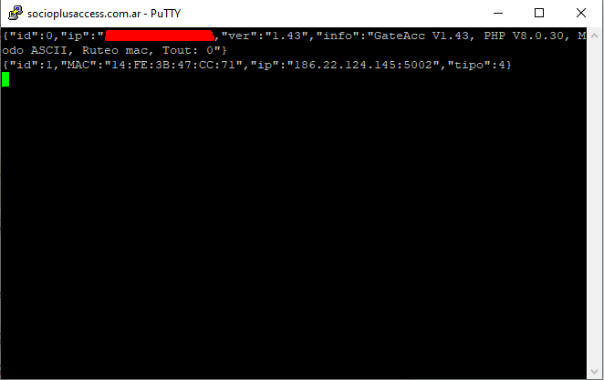
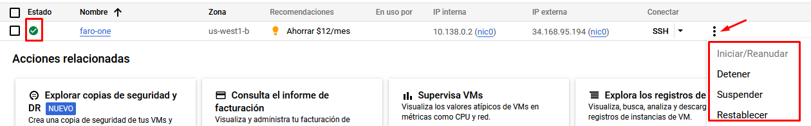
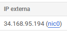
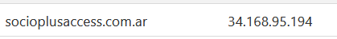
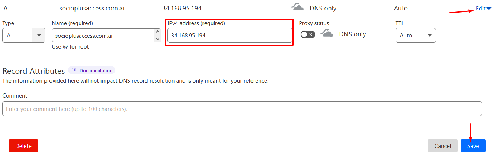
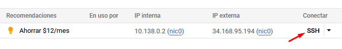
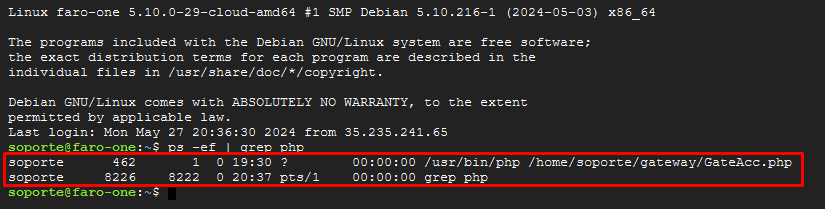
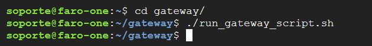

# Control de acceso — Placas para QR


Si la instalación usa un lector QR conectado a la PC con base de datos local en Access (en lugar de una placa IP dentro del molinete), consultá la sección [Configuración de Molinete con Lector QR](../lector-qr/README.md).


## Características

Existen dos tipos de código QR que puede escanear el socio para ingresar:

* El código QR que permite el ingreso vía placa y molinete. Lo debe generar el área de Soporte, desde el ingreso a la cuenta → `Opciones` → `Nodos`.
* El código QR que permite dar el presente **sin** molinete. Este lo genera el propio cliente desde el sistema, en `Home` → `Acceso` → `Download QR`.


Esta placa es compatible únicamente con los molinetes de **GSD**. No es compatible con Tango.


* La instalación física de la placa la realiza GSD. SocioPLUS se encarga de la configuración y la puesta en marcha.
* Si bien es compatible con una puerta magnética, se recomienda utilizarla exclusivamente con un molinete.
* La placa se instala dentro del molinete y se conecta por Ethernet.
* Al escanear el QR, la app le muestra al usuario un mensaje indicando si su acceso es correcto o no, y una explicación en caso de ser incorrecto.

## Solución de problemas

<details>

<summary>El programa TestIP se queda en "Esperando conexiones"</summary>

Si al abrir el programa TestIP este se cuelga en `Esperando conexiones`, verificá lo siguiente:

* Que la PC y el dispositivo estén en la misma red, y que no estén siendo bloqueados por el firewall o algún otro filtro interno. Si tenés la IP de la placa, probá hacerle `ping`.
* Si el led de la placa está parpadeando de color rojo, significa que está conectada a otro servidor. En ese caso, hay que hacerle un Factory Reset (ver más abajo).

</details>

<details>

<summary>Cómo realizar Factory Reset a la placa</summary>

Puenteá los dos contactos que se muestran en la imagen. Conectá la placa a la corriente eléctrica con el puente colocado. Al encenderse, el led debería quedar fijo en color rojo. Mantené el puente 5 segundos y retiralo. Si se hizo correctamente, el led debería pasar a titilar en color verde.



</details>

<details>

<summary>Cómo verificar la conexión con el servidor (Putty)</summary>

Para verificar qué placas están online, enviar un comando de apertura manual, etc., se usa un cliente telnet como Putty, que permite conectarse al servidor.

1. Abrí Putty y colocá los ajustes de conexión. Podés ponerle un nombre a la configuración y guardarla con **Save**, para cargarla después con **Load**.



2. Hacé clic en **Open** para establecer la conexión. Si hay conexión, vas a ver una pestaña con todas las placas conectadas.




La conexión se cierra si pasan más de 15 segundos sin enviar un comando válido.



Si la ventana no muestra ningún mensaje, andá a la sección **"Cómo restablecer el servidor caído"**, más abajo.


Desde esta conexión podés enviar comandos de apertura a la MAC deseada, con este formato:

```
{"id": *MAC ADDRESS*, "buf":"014F0301013C00"}
```

Ese comando habilita la salida 1 por 6 segundos. Para más información, consultá el PDF `conAcc16.pdf`.

</details>

<details>

<summary>Cómo restablecer el servidor caído</summary>

Si se cae el servidor de las placas, seguí estos pasos:

1. Verificá con Putty si hay conectividad con el servidor (ver el apartado anterior).

2. Verificá que la instancia del servidor esté ejecutándose en [Google Cloud](https://console.cloud.google.com/compute/instances?project=mikeon-molinetes-2024-02-27).



Vas a poder darte cuenta de su estado por:

* El `Estado` tiene un tick verde.
* En `Opciones`, el botón de **Iniciar** aparece deshabilitado (porque ya está iniciada).

Si estuviera apagada, iniciala y aceptá los avisos que se muestren. Esperá 2 o 3 minutos a que la máquina virtual termine de iniciarse, y volvé a intentar la conexión por Putty.

3. Verificá que el dominio `socioplusaccess.com.ar` esté vinculado a la misma IP que la IP externa de la máquina virtual.





Si no son idénticas, editá el [registro DNS](https://dash.cloudflare.com/982b2c155832920d5daed442e2c2fc6c/socioplusaccess.com.ar/dns/records) colocando la nueva IP obtenida en Google Cloud, y guardá los cambios.



4. Verificá que el script de Gateway se esté ejecutando en la máquina virtual. Volvé al listado de instancias y hacé clic en **SSH**. Aceptá o autorizá cualquier mensaje que aparezca.



5. Una vez dentro, ejecutá el comando:

```
ps -ef | grep php
```

Deberías ver dos resultados: el proceso del servidor (`/usr/bin/php /home/soporte/gateway/GateAcc.php`) y el propio comando `grep php` que ejecutaste.



6. Si aparece un único resultado (solo el `grep php`, sin el proceso del servidor), corré los siguientes comandos para levantar el script manualmente:

```
cd gateway/
./run_gateway_script.sh
```




La capacidad actual de la máquina virtual es de 8 CPU y 32 GB de RAM.


</details>
