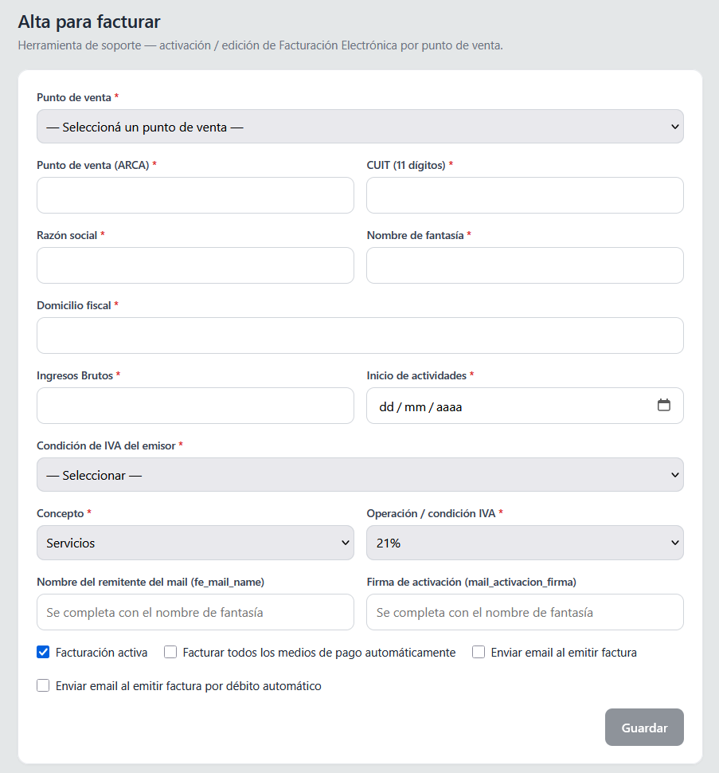
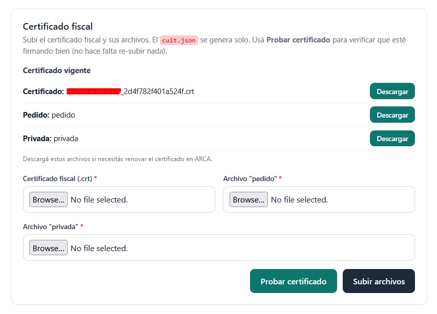

# Alta de Factura Electrónica

Este documento describe el procedimiento interno que sigue el equipo de soporte cuando un cliente solicita comenzar a utilizar el módulo de Factura Electrónica. Cubre los datos que hay que pedirle al cliente, la generación de los archivos necesarios para el Certificado Fiscal, el envío a AFIP a través del cliente, y la carga y validación final del alta en el panel de soporte.


Antes de avanzar, verificá que el cliente tenga contratado el **Plan Plus** o sea **Empresa**. Si no cumple ninguna de las dos condiciones, no se debe avanzar con el procedimiento: hay que informarle que solicite el módulo escribiendo a [**info@socioplus.com.ar**](mailto:info@socioplus.com.ar).


## Precio del servicio

El costo del servicio para dar de alta la Factura Electrónica es de **$150.000 + IVA**.

## Procedimiento



### Solicitar los datos al cliente

Pedile al cliente los siguientes datos:

| Dato               | Detalle                                                |
| ------------------ | ------------------------------------------------------ |
| Nombre de Fantasía | Nombre comercial del cliente                           |
| CUIT               | Sin guiones, se va a usar así en los comandos          |
| Razón social       | Razón social registrada en AFIP                        |
| Punto de Venta     | Punto de venta a habilitar para la factura electrónica |



### Generar los archivos Pedido y Privada con OpenSSL

Una vez que el cliente envía sus datos, hay que generar dos archivos —`pedido` y `privada`— que el cliente va a necesitar para tramitar el Certificado Fiscal en AFIP junto con su contador.

1. Descargá el archivo `.rar` de OpenSSL.
2. Andá a la carpeta raíz de OpenSSL, dentro de `bin`, y ejecutá `openssl.exe`.
3. Ejecutá los siguientes comandos, en este orden:

```
genrsa -out privada 2048
req -new -config openssl.cnf -key privada -out pedido
```

4. El segundo comando va a pedir los datos a continuación, uno por uno. Completalos así:

| Dato solicitado    | Valor a ingresar               |
| ------------------ | ------------------------------ |
| País               | `AR`                           |
| Razón social       | Razón social del cliente       |
| Nombre de Fantasía | Nombre de fantasía del cliente |
| CUIT               | CUIT del cliente               |


El CUIT se debe escribir **sin guiones**.




### Guardar y verificar los archivos generados

En la misma carpeta de OpenSSL, vas a encontrar los archivos `pedido` y `privada`. Verificá que la fecha y hora de ambos coincida con el momento en que ejecutaste los comandos.

Guardá los dos archivos en el Drive, en `Factura Electrónica` → creá una carpeta con el nombre del cliente. Esa carpeta debe contener también los datos solicitados al cliente y, más adelante, la constancia de alta de punto de venta/emisión.



### Enviar los archivos al cliente y solicitar el certificado

Enviale al cliente los archivos `pedido` y `privada` (en la misma cadena de mail donde te envió sus datos), y pedile que te devuelva:

* El **Certificado Fiscal**, con extensión `.CRT`, **sin renombrar**.
* La **Constancia de alta de punto de venta / emisión**.
* Si desea recibir un mail cada vez que se emite una factura (consultaselo directamente).



### Completar el alta en el panel de soporte

Antes de continuar, corroborá que todo lo que mandó el cliente esté correcto y completo.

Entrá a la página de soporte, ingresá a la sede del cliente y andá a [`https://gestion.socioplus.com.ar/factura_electronica`](https://gestion.socioplus.com.ar/factura_electronica). Ahí vas a encontrar el formulario **Alta para facturar**.



Completá los siguientes campos:

| Campo                       | Valor a completar                                                                          |
| --------------------------- | ------------------------------------------------------------------------------------------ |
| Punto de venta              | Sede del gimnasio en la que se va a realizar la facturación                                |
| Punto de venta (ARCA)       | El punto de venta que informó el cliente                                                   |
| CUIT (11 dígitos)           | CUIT del cliente                                                                           |
| Razón social                | Razón social del cliente                                                                   |
| Nombre de fantasía          | Nombre de fantasía del cliente                                                             |
| Domicilio fiscal            | Domicilio fiscal del cliente                                                               |
| Ingresos Brutos             | El mismo valor que el CUIT                                                                 |
| Inicio de actividades       | Se encuentra en la constancia de alta de punto de venta que envió el cliente               |
| Condición de IVA del emisor | IVA Responsable Inscripto / IVA Sujeto Exento / Responsable Monotributo, según corresponda |


Los demás campos del formulario se completan automáticamente.


Hacé clic en **Guardar** y luego en **Actualizar**. Al hacerlo, va a aparecer debajo la sección para cargar el certificado.



### Subir el certificado y probarlo

En la sección **Certificado fiscal** que aparece luego de guardar, subí:

* El **Certificado fiscal (.crt)**, tal cual lo envió el cliente.
* El archivo `pedido` generado previamente.
* El archivo `privada` generado previamente.



Hacé clic en **Subir archivos**.

Por último, hacé clic en **Probar certificado** para verificar que el certificado esté firmando correctamente y que toda la información cargada sea correcta. No hace falta volver a subir nada para esta prueba.



### Confirmar el alta con el cliente

Una vez que la prueba del certificado sea exitosa, avisale al cliente y enviale los instructivos y videos explicativos del módulo de Factura Electrónica, incluyendo el instructivo de cómo cargar los datos impositivos en el perfil del socio.


