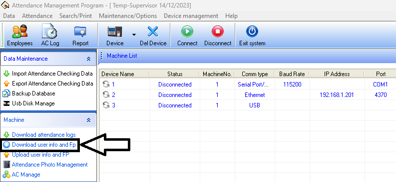
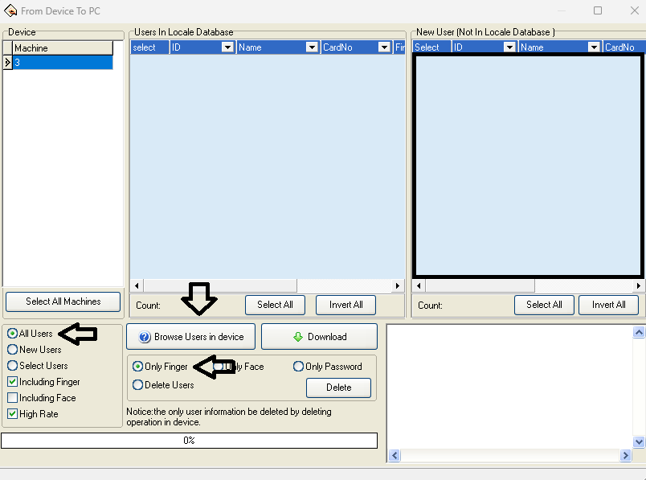

# Cómo buscar huellas en el reloj

Para buscar las huellas de un socio en el reloj, hay que hacerlo desde el programa **Attendance Management**.



### Abrir Attendance Management

Abrí el programa Attendance Management.



### Descargar la información del dispositivo

En la parte izquierda de la pantalla, dentro del apartado `Machine`, hacé clic en **Download user info and Fp**.




### Configurar la búsqueda

En la ventana emergente que se abre, hacé estas selecciones:

* Seleccioná el dispositivo en el que querés buscar, en `Machine`.
* Seleccioná `All Users`.
* Seleccioná `Only Finger`.




### Buscar al socio

Hacé clic en **Browse User in device**. Si el socio aparece en la lista, es porque su huella se encuentra cargada en el dispositivo.


