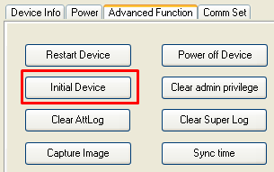

# Cómo depurar los datos de un control de acceso con huella (reloj)

Es importante depurar la información del reloj para poder enrolar las huellas de los socios.



### Hacer un backup

Hacé un backup de la base de datos actual antes de continuar.



### Limpiar la tabla de huellas

Ingresá a la base de datos y eliminá los registros de la tabla `sociosHuellas`.



### Conectarte al reloj

Ingresá al programa **Attendance Management**. Hacé clic sobre la IP del reloj y presioná **Connect**. Esperá a que el estado (`Status`) pase de `Disconnected` a `Connected`.



### Consultar la información del dispositivo

Hacé clic derecho sobre la conexión del reloj y entrá a `Property` › `Device Info`. Hacé clic en **Read options** (al pie de la ventana) para ver la información almacenada en el reloj.



### Inicializar el dispositivo

Andá a `Advanced Function` › `Initial Device`.

Confirmá la acción y listo.


