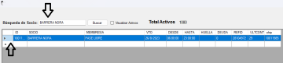
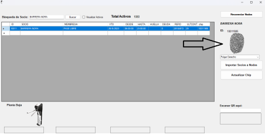

# Cómo enrolar huellas con el reloj

Este documento describe cómo enrolar huellas en el reloj mediante el sistema de control de acceso, cuando el propio reloj toma la huella (sin usar un sensor externo como el ZK9500).



### Abrir el programa

Abrí el programa `SPControlAcceso`, que se encuentra en el escritorio.



### Buscar al socio

En el campo `BÚSQUEDA DE SOCIOS`, localizá al socio al que le vas a enrolar la huella y seleccionalo.




### Iniciar el registro de huella

Con el socio seleccionado, vas a ver el ícono de la huella en la parte derecha de la ventana. Hacé clic sobre ese ícono.




### Tomar la huella

Pedile al socio que coloque su huella en el lector del reloj, para que la tome y registre.



### Guardar

Una vez tomada la huella, seleccioná la opción **Guardar**.


