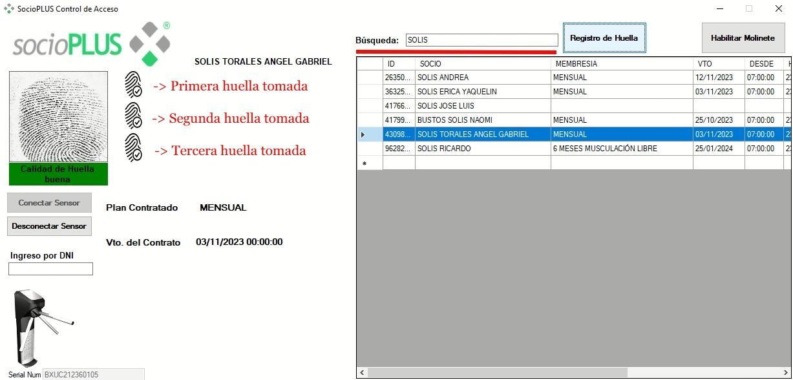

# Cómo enrolar huellas con el lector ZK9500



### Abrir el programa

Abrí el programa de control de acceso instalado en la PC.



### Buscar al socio

En el campo `BÚSQUEDA DE SOCIOS`, localizá al socio al que le vas a enrolar la huella.



### Iniciar el registro de huella

Seleccioná al socio y presioná el botón **Registro de Huella**.



### Tomar la huella

Pedile al socio que apoye su huella sobre el lector **3 veces**, para que el sistema la registre. Cada vez que apoye la huella correctamente, vas a ver el mensaje **"Calidad de huella buena"** junto con un símbolo que confirma que se tomó bien.

Una vez tomadas las 3 huellas, el socio queda enrolado.




Al día siguiente hay que generar la importación de los socios, para que el reloj sincronice la información correspondiente.

