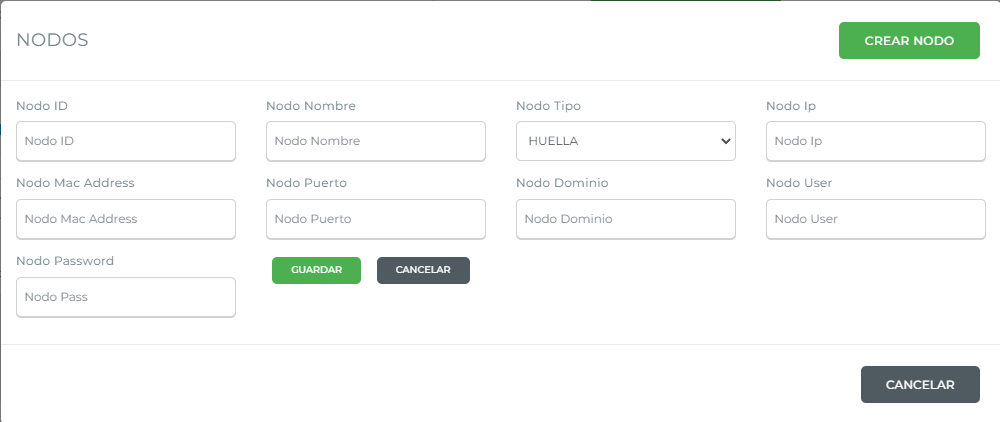
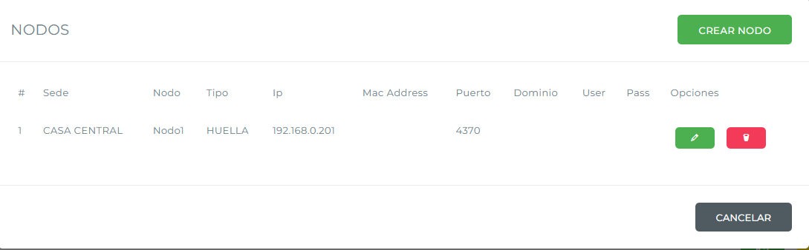
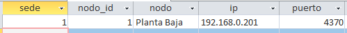
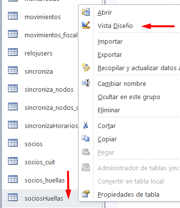
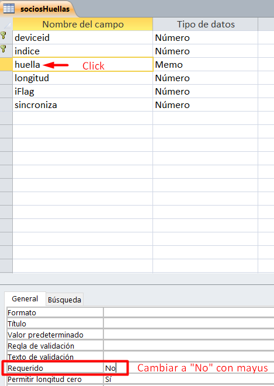

# Instalación con ZK9500

Este documento describe el procedimiento de instalación del control de acceso con el lector de huella digital ZK9500. Está dirigido al equipo de soporte técnico encargado de realizar la instalación en la sede del cliente.


Antes de instalar, verificá que la PC cumpla con los [requerimientos para una instalación](https://docs.google.com/document/d/1MI-zniR0nJHE0xqoOqe48sUwHTYPFEdu2MaFYw4moGE/edit?usp=drive_link).


## Paso previo: cargar los nodos

Completá la información de los nodos, previamente consultada al cliente, en [`gestion.socioplus.com.ar/soporte`](https://gestion.socioplus.com.ar/soporte) buscando por ID de cliente. Primero ingresá a la sede correspondiente y luego a `Nodos`. Asegurate de que los datos queden guardados correctamente en el cliente seleccionado.

Antes de empezar la instalación, abrí un Bloc de notas y respondé las preguntas que se indican en [PROCEDIMIENTO SOPORTE.docx](https://docs.google.com/document/d/1FiFYL9uSOERwpGWvrVg_pkBhZXl-l8K5/edit?usp=drive_link).

## Procedimiento de instalación



### Configurar el sistema

Andá a `Panel de control` › `Región` y configurá la fecha y hora del equipo:

* **Formato:** verificá que esté configurado como `Español (Argentina)` (en caso de ser clientes de Argentina).
* **Configuración adicional** › pestaña **Fecha**: `Fecha corta` debe tener el formato `dd/MM/aaaa`.
* **Configuración adicional** › pestaña **Hora**: `Hora corta` debe tener el formato `HH:mm`, y `Hora larga` el formato `HH:mm:ss`.

Por último, hacé clic en **Aplicar** y en **Aceptar** para guardar los cambios.



### Copiar los drivers

Creá una carpeta con el nombre `socioPLUS` en `Mis documentos` del equipo. Verificá en qué partición se encuentra.

Los drivers se obtienen del Drive del mail de soporte, en la carpeta [`Configuración Reloj 9500`](https://drive.google.com/drive/folders/1U1PrwCzpiJBHqqd6lSZ0lbv5L8efSQja):

* Descargá `socioplus_zk9500.rar` y descomprimilo en la carpeta `socioPLUS` que creaste en la PC del cliente.
* Descargá también `zkfinger_sdk_v10.0-windows-lite-zk9500.zip`, que se usa más adelante.



### Parametrizar el archivo config.ini

Abrí `config.ini` y completá los siguientes valores:

| TAG | Campo | Valor |
|---|---|---|
| `[Cliente]` | `Idcliente` | ID del cliente. Se consigue en [`gestion.socioplus.com.ar/soporte`](https://gestion.socioplus.com.ar/soporte), buscando al cliente. Ejemplo: `db82037fc12bfe1d50cb488f997e394` |
| `[Cliente]` | `Sede` | Número de sede a la que se le está instalando el sistema. Se consigue en el mismo panel. |
| `[Cliente]` | `cmd_exe` | Ruta del archivo `ZkFingerDemo.exe`, dentro de la carpeta `socioPLUS`. Ejemplo: `C:\Documentos\socioPLUS\ZkFingerDemo.exe` |
| `[Micro]` | `M1` | `100` |
| `[Micro]` | `M2` | `101` |
| `[BD]` | `Path` | Raíz donde se instaló el control de acceso. Ejemplo: `D:\Documentos\socioPLUS` |
| `[BD]` | `Path_datos` | Raíz de instalación + carpeta `datos`. Ejemplo: `D:\Documentos\socioPLUS\datos` |
| `[BD]` | `Path_imagenes` | Debe quedar en blanco |
| `[BD]` | `Path_fotos` | Raíz de instalación + carpeta `fotos`. Ejemplo: `D:\Documentos\socioPLUS\fotos` |


Si los micros `M1` y `M2` están invertidos en la instalación física, hay que invertir también estos valores en el archivo.


Guardá el archivo una vez aplicados los cambios.



### Parametrizar la base de datos SPControlAcceso.mdb

Abrí la base de datos con Microsoft Access y revisá las siguientes tablas:

| Tabla | Qué verificar |
|---|---|
| `ingresos` | Debe estar en blanco. Si no lo está, eliminar sus movimientos. |
| `ingresos_bk` | Debe estar en blanco. Si no lo está, eliminar sus movimientos. |
| `movimientos` | Debe estar en blanco. Si no lo está, eliminar sus movimientos. |
| `sincroniza` | Actualizar la sede, el ID de cliente, la IP del reloj (solicitada previamente al cliente, se la provee el instalador del reloj y el molinete), el modelo de reloj y los indicadores `Bhuellazk` y `accesocondeuda` (ver detalle abajo). |
| `sincroniza_nodos` | Contiene la información de los nodos. Por cada nodo se debe crear un registro con la sede, el ID del nodo, el nombre del nodo, su IP y su puerto. |
| `socios` | Debe estar en blanco. Si no lo está, eliminar sus movimientos. |
| `sociosHuellas` | Debe estar en blanco. Si no lo está, eliminar sus movimientos. Además, el campo `huella` (el segundo) debe tener `Requerido` en `No` (ver más abajo). |

En la tabla `sincroniza`, completá también:

| Campo | Valor |
|---|---|
| `Reloj Modelo` | `1` si el reloj tiene display, `0` si no tiene display |
| `Bhuellazk` | `1` si se usa un lector para enrolar y otro para ingresar. `0` si el lector se usa solo para ingresar. |
| `accesocondeuda` | `1` si el socio puede ingresar con deuda, `0` si no puede ingresar con deuda |


Modelos de reloj **con display** compatibles: ZKTeco F11, ZKTeco F19, ZKTeco F22.

Modelo de reloj **sin display** compatible: MA300.


Para editar el campo `huella` de la tabla `sociosHuellas`, hacé clic derecho sobre la tabla y entrá a `Vista Diseño`.

Guardá los cambios y luego ejecutá `Compactar y reparar base de datos`.



### Instalar los archivos DLL

Copiá los archivos de la carpeta `DLL` a `C:\Windows\syswow64`.

1. Buscá `CMD` en Windows, hacé clic derecho y seleccioná **Ejecutar como administrador**.

2. Escribí `cd C:\Windows\SysWOW64` para moverte a esa carpeta. Si no funciona, usá el comando `cd` para ir navegando manualmente: `C:\` → `Windows` → `SysWOW64`.
3. Una vez en esa carpeta, ejecutá `regsvr32 (nombre del archivo dll)` y presioná **Enter**, repitiendo el comando para cada uno de los archivos que copiaste. Al terminar, cerrá la consola.
4. Desde la carpeta `Dll\time5.0`, ejecutá como administrador el archivo `setup.exe` y avanzá con **Siguiente** hasta finalizar la instalación.
5. Extraé `zkfinger_sdk_v10.0-windows-lite-zk9500.zip` en la carpeta `Dll`, entrá a `ZKFinger SDK V10.0-Windows-Lite` y ejecutá `setup.exe` **como administrador**.

Por último, creá un acceso directo del programa `SpControlAcceso.exe` en el escritorio.


El acceso directo debe ser del programa `SpControlAcceso.exe`. **No** del ejecutable de nodos web.




## Antes de las pruebas: vincular los planes a los nodos

Para que los socios ingresen correctamente y el sistema web valide su acceso, sus contratos deben estar vinculados a los nodos correspondientes.



### Ingresar a la configuración del sistema

Entrá a `Menú` › `Setup` › `Configuración del sistema`.



### Editar el concepto

Localizá el concepto que vas a vincular y entrá a `Editar concepto` › `Deseo solo vincular planes a los nodos`.



### Seleccionar los nodos y guardar

Seleccioná el o los nodos por los cuales podrá ingresar el socio, y hacé clic en **Guardar** para aplicar los cambios.




## Pruebas

Enseñale a la persona encargada de asistirte a usar el programa SPacceso y a [enrolar la huella](como-enrolar-huellas-zk9500.md) (al finalizar le vas a enviar un instructivo de cómo hacerlo).



### Elegir un socio de prueba

Consultá si hay un perfil creado sin deuda y con un contrato vigente. Si no hay ninguno, podés elegir un socio al azar del listado (que no sea de categoría Staff/Personal) y enrolarle la huella.



### Verificar el ingreso

Una vez enrolada la huella, verificá que el socio pueda ingresar y que el molinete abra correctamente. Cerrá el programa y [verificá si la huella se encuentra en el reloj](https://drive.google.com/file/d/1NU6Lk9fk21zFjYIaN8KGOBXExQ5ZrQxs/view?usp=drive_link), en caso de corresponder.



### Repetir la comprobación

Repetí esta comprobación al menos 3 veces, para asegurarte de que todo esté funcionando correctamente.



### Cerrar la instalación

Una vez finalizadas las pruebas, pedile al cliente que envíe por mail el acta de conformidad, y guardala en [ACTAS DE CONFORMIDAD](https://drive.google.com/drive/folders/1xfpaaLYJxsa5M1msdlo3qoQ68zXNU4rz?usp=drive_link).




Es importante hacer seguimiento de la instalación a las 24 horas de haberla realizado.

