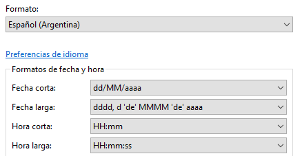
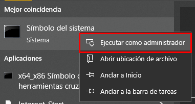

# Instalación con Tango

Este documento describe el procedimiento de instalación del control de acceso con molinete Tango. La instalación es muy similar a la de [llaveros](../llaveros/instalacion-molinete-llaveros.md): opera con una base de datos local en Microsoft Access, pero la apertura del molinete la maneja el propio instalador de Tango en lugar de un puerto COM.


Antes de instalar, verificá que la PC cumpla con los [requerimientos para una instalación](https://docs.google.com/document/d/1MI-zniR0nJHE0xqoOqe48sUwHTYPFEdu2MaFYw4moGE/edit?usp=drive_link).


## Paso previo: cargar los nodos

Ingresá a [`gestion.socioplus.com.ar/soporte`](https://gestion.socioplus.com.ar/soporte), buscá al cliente y entrá. Repetí el ingreso, pero esta vez entrá a `Nodos`. Completá la información de los nodos previamente consultada al cliente, y asegurate de que se guarde correctamente en el cliente seleccionado.


Antes de empezar la instalación, abrí un Bloc de notas y respondé las preguntas que se indican en [PROCEDIMIENTO SOPORTE.docx](https://docs.google.com/document/d/1FiFYL9uSOERwpGWvrVg_pkBhZXl-l8K5/edit?usp=drive_link).

## Procedimiento de instalación



### Configurar el sistema

Andá a `Panel de control` › `Reloj y región` › `Cambiar formatos de fecha, hora o número`.

* **Formato:** verificá que esté configurado como `Español (Argentina)` (en caso de ser clientes de Argentina).
* **Configuración adicional** › pestaña **Fecha**: `Fecha corta` debe tener el formato `dd/MM/aaaa`.
* **Configuración adicional** › pestaña **Hora**: `Hora corta` debe tener el formato `HH:mm`, y `Hora larga` el formato `HH:mm:ss`.



Por último, hacé clic en **Aplicar** y en **Aceptar** para guardar los cambios.



### Descargar los drivers

Los drivers se obtienen del Drive de soporte, en la carpeta `Configuración Molinetes Tango`. Descargá el archivo `Control Acceso Tango.zip` y descomprimilo en la carpeta `Documentos`.



### Parametrizar el archivo config.ini

Abrí `config.ini` y completá los siguientes valores:

| TAG | Campo | Valor |
|---|---|---|
| `[Cliente]` | `Idcliente` | ID del cliente. Se consigue en [`gestion.socioplus.com.ar/soporte`](https://gestion.socioplus.com.ar/soporte), buscando al cliente. Ejemplo: `db82037fc12bfe1d50cb488f997e394` |
| `[Cliente]` | `Sede` | Número de sede a la que se le está instalando el sistema. Se consigue en el mismo panel: es el número que aparece entre paréntesis junto al nombre de la sede. Ejemplo: `CASA CENTRAL (1)` → `1` |
| `[BD]` | `Path` | Raíz donde se instaló el control de acceso. Ejemplo: `D:\Documentos\socioPLUS` |
| `[BD]` | `Path_datos` | Raíz de instalación + carpeta `datos`. Ejemplo: `D:\Documentos\socioPLUS\datos` |
| `[BD]` | `Path_imagenes` | Debe quedar en blanco |
| `[BD]` | `Path_fotos` | Raíz de instalación + carpeta `fotos`. Ejemplo: `D:\Documentos\socioPLUS\fotos` |


A diferencia de otras instalaciones, acá **no** se configura el puerto del molinete: Tango se encarga de eso a través de su propio instalador.


Guardá el archivo una vez aplicados los cambios.



### Parametrizar la base de datos SPControlAcceso.mdb

Abrí la base de datos con Microsoft Access y revisá las siguientes tablas:

| Tabla | Qué verificar |
|---|---|
| `ingresos` | Debe estar en blanco. Si no lo está, eliminar sus movimientos. |
| `ingresos_bk` | Debe estar en blanco. Si no lo está, eliminar sus movimientos. |
| `movimientos` | Debe estar en blanco. Si no lo está, eliminar sus movimientos. |
| `sincroniza` | Actualizar la sede, el ID de cliente y el campo `comando_apertura` (ver detalle abajo). |
| `sincroniza_nodos` | Si contiene información de nodos, actualizar el campo `sede` con el número de sede a instalar. Acepta solo números. |
| `socios` | Debe estar en blanco. Si no lo está, eliminar sus movimientos. |

En la tabla `sincroniza`, el campo `comando_apertura` debe tener la ruta del ejecutable que Tango instala en el disco `C:\`, dentro de la carpeta `Tango` o `TangoAccess`. Generalmente se llama `TangoAccess.exe`. Quedaría algo así:

```
C:\TangoAccess\TangoAccess.exe
```



### Instalar los archivos DLL

Copiá los archivos de la carpeta `DLL` a `C:\Windows\syswow64`.

1. Buscá `CMD` en Windows, hacé clic derecho y seleccioná **Ejecutar como administrador**.



2. Escribí `cd C:\Windows\SysWOW64` para moverte a esa carpeta. Si no funciona, usá el comando `cd` para ir navegando manualmente: `C:\` → `Windows` → `SysWOW64`.
3. Una vez en esa carpeta, ejecutá `regsvr32 (nombre del archivo dll)` y presioná **Enter**, repitiendo el comando para cada uno de los archivos que copiaste. Al terminar, cerrá la consola.



### Ejecutar el programa

Creá un acceso directo del archivo `SPAccesoTeclado.exe` en el escritorio de la PC.



## Pruebas

Enseñale a la persona encargada de asistirte a usar el programa `SPacceso`.



### Elegir un socio de prueba

Consultá si hay un perfil creado sin deuda y con un contrato vigente. Si no hay ninguno, podés elegir un socio al azar del listado (que no sea de categoría Staff/Personal). Ingresá su DNI para verificar que pueda ingresar.



### Verificar el ingreso

Una vez ingresado el DNI, verificá que el socio pueda ingresar y que el molinete abra correctamente. Repetí esta comprobación al menos 3 veces, para asegurarte de que todo esté funcionando correctamente.



### Cerrar la instalación

Una vez finalizadas las pruebas, pedile al cliente que envíe por mail el acta de conformidad, y guardala en [ACTAS DE CONFORMIDAD](https://drive.google.com/drive/folders/1xfpaaLYJxsa5M1msdlo3qoQ68zXNU4rz?usp=drive_link).




Es importante hacer seguimiento de la instalación a las 24 horas de haberla realizado.

